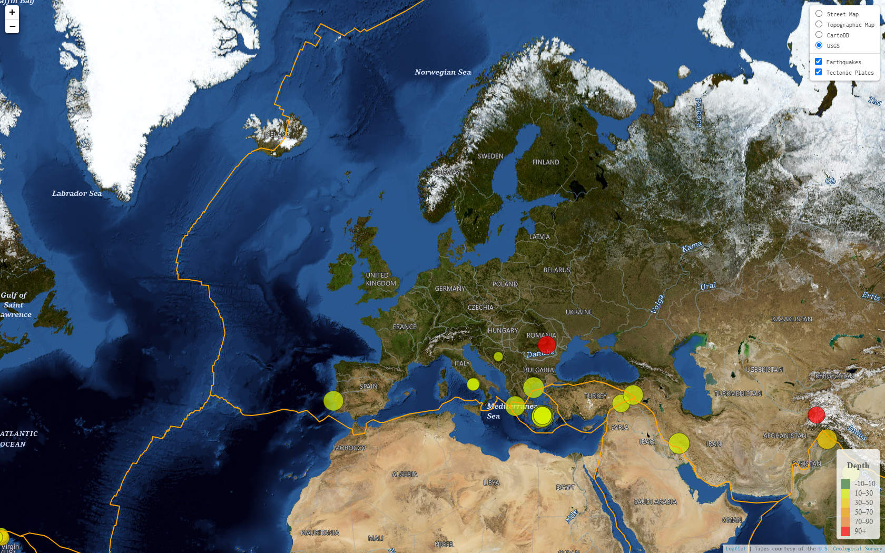

# USGS-Earthquake-Data
Using LeafLet to Visualize USGS Earthquake Data

# Leaflet Challenge
Using the Leaflet Javascript Library to Visualize USGS Earthquake Data

## Introduction
The [United States Geological Survey](https://www.usgs.gov/), or USGS for short, is responsible for providing scientific data about natural hazards, the health of our ecosystems and environment, and the impacts of climate and land-use change. They collect a massive amount of data from all over the world each day, including earthquake data. In this project, the [Leaflet Javascript library](https://leafletjs.com/) is employed to create a simple web-based visualization tool for [realtime earthquake data](https://earthquake.usgs.gov/earthquakes/feed/v1.0/geojson.php) for the past 30 days of magnitude 4.5 and above.

## USGS Earthquakes by HauHet plc. 
[Live Data](https://hauhet.co/ai/)

## Contents

   * Project Overview
   * Problem Statement and approach to solution
   * Metrics 
   * Dataset 
   * Exploratory Data Analysis and Data processing
   * Model implementation
   * Improvement and evaluation
   * Prediction and web application
   * Improvement and conclusion
   * acknowledgement

## Sources of data and Thanks❤️

*   Real-time earthquake data from [USGS](https://earthexplorer.usgs.gov/)
*   Maps used from [Mapbox](https://www.mapbox.com/) and [CartoDB](https://carto.com/)
*   World tectonic plates and boundaries from [fraxen](https://github.com/fraxen/tectonicplates)
*   Exterior design from [Mudi.ui](https://www.mdui.org/)
*   Map framework using the [Leaflet.js](https://leafletjs.com/) library
*   Data visualization using [D3.js](https://d3js.org/) library

 

 

### Copyright

HauHet plc. © 2023-2025. All Rights Reserved. [HauHet plc.](https://hauhet.co/)
